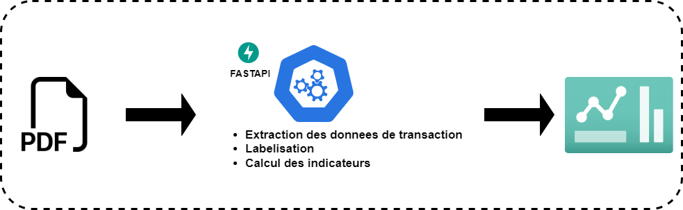

# bank-statement-analyzer-portfolio
BankStatementAnalyzerAPI est une interface de programmation d'application (API) puissante qui offre la capacité de lire des fichiers PDF de relevés bancaires et de calculer plusieurs indicateurs clés de performance (KPI) d'analyse financière. 

# Workflow
## Description
Cette API automatise le processus d'analyse des relevés bancaires, offrant ainsi une solution efficace pour les entreprises et les développeurs souhaitant extraire des informations précieuses de leurs données financières.



## Fonctionnalités

- **Analyse de Fichiers PDF** : BankStatementAnalyzerAPI peut traiter les relevés bancaires au format PDF provenant de différentes banques (ACESS BANK, ECO BANK, FCMB BANK, STERLING BANK, UNION BANK, WEMA BANK, ZENITH BANK).
  
- **Extraction des Données** : L'API extrait automatiquement les informations pertinentes des relevés bancaires, telles que les transactions, les soldes, les dates, etc.
  
- **Calcul des KPI d'Analyse Financière** : BankStatementAnalyzerAPI effectue divers calculs pour générer des KPI significatifs, tels que le solde moyen, les dépenses mensuelles, les revenus nets, etc.
  
- **Intégration Facile** : L'API est conçue pour être facilement intégrée dans n'importe quelle application existante, offrant ainsi une solution robuste pour l'automatisation de l'analyse des relevés bancaires.


## les KPI
```
{
	"nbTotalCreditTurnover": 171,
	"nbTotalDebitTurnover": 1117,
	"nbAverageMonthlyCredit": 24,
	"nbAverageMonthlyDebit": 159,
	"nb_month_activity": 7,
	"accountActivity": 0.83,
	"averageBalance": 204193,
	"averageCredits": 126599,
	"averageDebits": 19188,
	"initialBalance": 56596,
	"closingBalance": 272033,
	"firstDay": "2023-05-01",
	"lastDay": "2023-11-02",
	"monthPeriod": 7,
	"noOfTransactingMonths": 7,
	"totalCreditTurnover": 21648400,
	"totalDebitTurnover": 21432964,
	"yearInStatement": 2023,
	"netAverageMonthlyEarnings": 0,
	"airtime": 0,
	"totalExpenses": 3061113,
	"savingsAndInvestments": 107161,
	"mobileSpend": 0,
	"webSpend": 16172,
	"bundleSpend": 0,
	"entertainment": 0,
	"inflowOutflowRate": "Negative Cash Flow",
	"topIncomingTransferAccount": "olatubosun jaco olatubosun jac",
	"topTransferRecipientAccount": "abuduwaheed ade",
	"lastDateOfCredit": "2023-11-02",
	"lastDateOfDebit": "2023-11-02",
	"averageOtherIncome": 0,
	"averageSalary": 0,
	"netCashFlow": 30777,
	"MaxMonthlyRepayment": 12311,
	"averageMonthlyCredit": 3092629,
	"averageMonthlyDebit": 3061853,
	"totalMonthlyCredit": 21648400,
	"totalMonthlyDebit": 21432965,
	"noOfTransactingDays": 153,
	"dayPeriode": 186,
	"confidenceIntervalOnSalaryDetection": null,
	"expectedSalaryDay": null,
	"lastSalaryDate": null,
	"medianIncome": null,
	"numberOtherIncomePayments": 0,
	"numberOfSalaryPayments": 0,
	"salaryEarner": false,
	"salaryFrequency": null,
	"averageRecurringExpense": null,
	"bankCharges": 1975,
	"bills": 0,
	"gambling": 10172,
	"dab": 72307,
	"hasRecurringExpense": false,
	"internationalTransactionsSpend": 0,
	"posSpend": 2863504,
	"spendOnTransfers": 2425403,
	"ussdTransactions": 2,
	"accountSweep": false,
	"gamblingRate": null,
	"loanAmount": 0,
	"loanInflowRate": 0.0,
	"loanRepaymentInflowRate": 0.0009423329206777406,
	"loanRepayments": 20400,
	"highestMAWOCredit": 5,
	"highestMAWODebit": 1,
	"MAWWZeroBalanceInAccount": null,
	"mostFrequentBalanceRange": {
		"min": 0,
		"max": 100000,
		"count": 707
	},
	"mostFrequentTransactionRange": {
		"min": 0,
		"max": 100000,
		"count": 1206
	},
	"NODWBalanceLess5000": 3,
	"recurringExpense": [],
	"transactionsBetween100000And500000": 94,
	"transactionsBetween10000And100000": 624,
	"transactionsGreater500000": 12,
	"transactionRanges": [
		{
			"min": 0,
			"max": 10000,
			"count": 617
		},
		{
			"min": 10000,
			"max": 20000,
			"count": 253
		},
		{
			"min": 20000,
			"max": 30000,
			"count": 124
		},
		{
			"min": 30000,
			"max": 40000,
			"count": 49
		},
		{
			"min": 40000,
			"max": 50000,
			"count": 57
		},
		{
			"min": 50000,
			"max": 60000,
			"count": 47
		},
		{
			"min": 60000,
			"max": 70000,
			"count": 13
		},
		{
			"min": 70000,
			"max": 80000,
			"count": 11
		},
		{
			"min": 80000,
			"max": 90000,
			"count": 8
		},
		{
			"min": 90000,
			"max": 100000,
			"count": 27
		},
		{
			"min": 100000,
			"max": 110000,
			"count": 13
		},
		{
			"min": 110000,
			"max": 120000,
			"count": 1
		},
		{
			"min": 120000,
			"max": 130000,
			"count": 2
		},
		{
			"min": 130000,
			"max": 140000,
			"count": 2
		},
		{
			"min": 140000,
			"max": 150000,
			"count": 8
		},
		{
			"min": 150000,
			"max": 160000,
			"count": 2
		},
		{
			"min": 160000,
			"max": 170000,
			"count": 2
		},
		{
			"min": 170000,
			"max": 180000,
			"count": 4
		},
		{
			"min": 190000,
			"max": 200000,
			"count": 12
		},
		{
			"min": 200000,
			"max": 210000,
			"count": 1
		},
		{
			"min": 240000,
			"max": 250000,
			"count": 6
		},
		{
			"min": 260000,
			"max": 270000,
			"count": 1
		},
		{
			"min": 270000,
			"max": 280000,
			"count": 1
		},
		{
			"min": 290000,
			"max": 300000,
			"count": 7
		},
		{
			"min": 390000,
			"max": 400000,
			"count": 7
		},
		{
			"min": 440000,
			"max": 450000,
			"count": 1
		},
		{
			"min": 490000,
			"max": 500000,
			"count": 5
		},
		{
			"min": 590000,
			"max": 600000,
			"count": 1
		},
		{
			"min": 600000,
			"max": 610000,
			"count": 1
		},
		{
			"min": 610000,
			"max": 620000,
			"count": 1
		},
		{
			"min": 790000,
			"max": 800000,
			"count": 1
		},
		{
			"min": 890000,
			"max": 900000,
			"count": 1
		},
		{
			"min": 990000,
			"max": 1000000,
			"count": 1
		},
		{
			"min": 1090000,
			"max": 1100000,
			"count": 1
		}
	],
	"status": "success",
	"errors": []
}
```


## Outils et Technologies
Le projet utilise les technologies et outils suivants :
- **Langages de programmation** : Python, Java
- **Frameworks et bibliothèques** : Fastapi, Pandas, Tabula 
- **Bases de données** : 
- **Formats de données** : JSON, JWT
- **Conteneurisation** : Docker


## Installation
Pour installer et exécuter ce projet localement, veuillez suivre les étapes ci-dessous :

1. Clonez le dépôt :
    ```bash
    git clone -b main --depth=1  https://github.com/hanyfy/bank-statement-analyzer-portfolio.git
    ```

2. Accédez au répertoire du projet :
    ```bash
    cd bank-statement-analyzer-portfoli/source
    ```

3. Run :
    ```bash
    docker-compose up --build
    ```

    

4. Accédez à l'application via votre navigateur à l'adresse :
    ```
    http://127.0.0.1:8083/docs (pour la documentation de l'api)
    ```


## Utilisation

Voici un exemple d'utilisation de BankStatementAnalyzerAPI en Python :

```python
import requests

# URL de l'API
api_url = "https:/localhost:8083/calcul"

# Charger le fichier PDF du relevé bancaire
fichier_pdf = {
        
    "files": [
        {
            "file": {
                "path": "bank_statement.pdf",
                "name": "bank_statement.pdf",
                "baseUrl": "https:/~~/",
                "accessCode": 6521
            },
            "analysisType": {
                "id": 1,
                "name": "Relevé bancaire",
                "code": "BANK"
            },
            "fileType": {
                "id": 1,
                "name": "PDF",
                "code": "PDF"
            },
            "institution": {
                "id": 4,
                "name": "ACCESS BANK",
                "address": "Bank adress",
                "phone": "981987",
                "city": "test",
                "country": {
                    "id": 2,
                    "name": "Nigeria",
                    "code": "NGA"
                }
            }
        }
    ]
}


# Envoyer une requête POST avec le fichier PDF
reponse = requests.post(api_url, json=fichier_pdf, auth=("admin@admin.fr", "F$7wB#2nK*9v"))

# Afficher la réponse de l'API
print(reponse.json())
```


## Contribution
Les contributions sont les bienvenues ! Si vous souhaitez contribuer, veuillez créer une branche à partir de `main`, apporter vos modifications, puis soumettre une pull request.

## Licence
Ce projet est sous licence MIT. Pour plus de détails, veuillez consulter le fichier `LICENSE`.

## Auteurs
- [RAMAMONJISOA Nomenjanahary Hany Fy](https://github.com/hanyfy)
- [ramamonjisoafy@gmail.com](https://github.com/hanyfy)

Merci de votre intérêt pour ce projet ! N'hésitez pas à me contacter pour toute question ou suggestion.